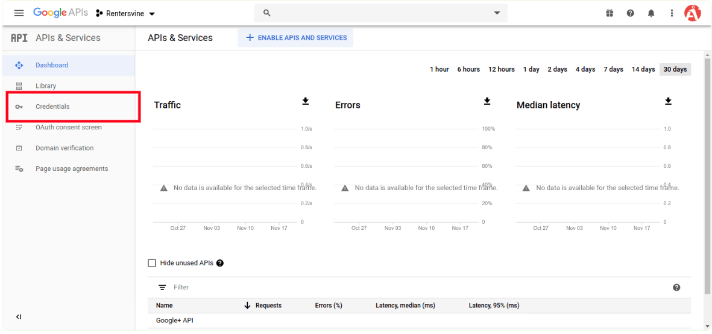
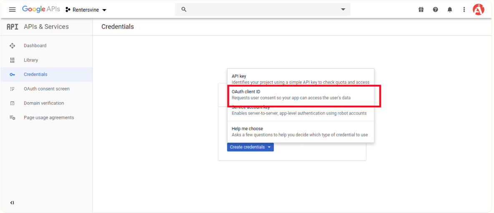
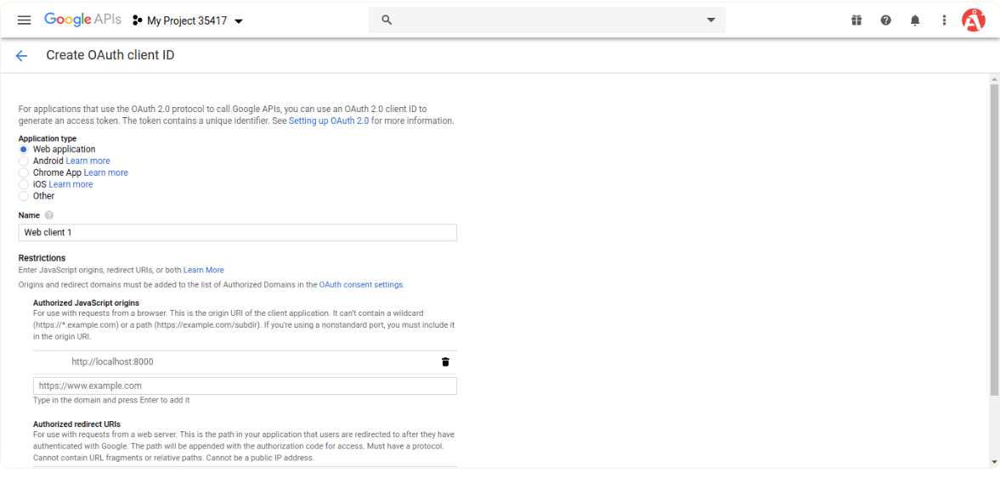
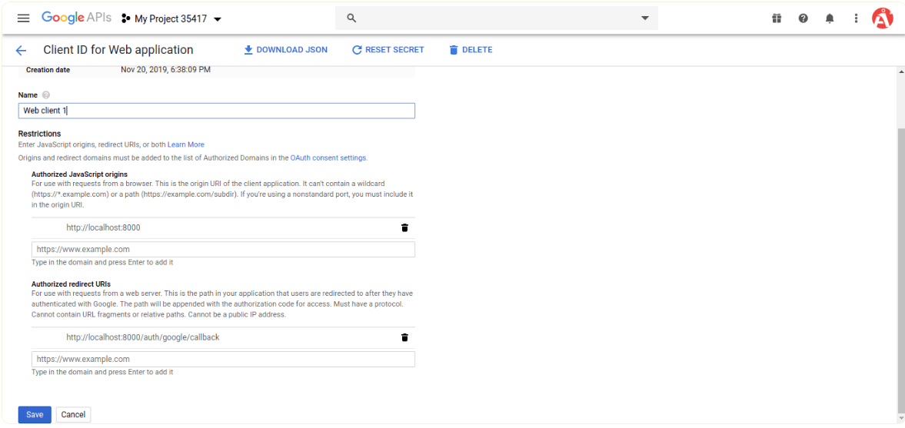
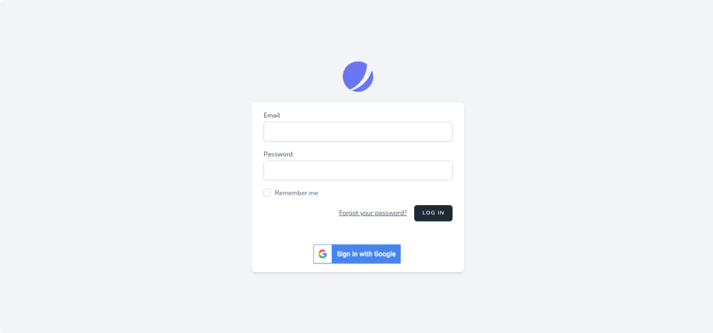

# laravel9_socialite_login_with_google_account
## 1: Install Laravel 9
```Dockerfile
composer create-project laravel/laravel laravel9_socialite_login_with_google_account
```
## 2: Install JetStream
```Dockerfile
composer require laravel/jetstream
```
```Dockerfile
php artisan jetstream:install livewire
```
```Dockerfile
npm install
```
```Dockerfile
npm run dev
```
```Dockerfile
php artisan migrate
```
## 3: Install Socialite
- Bước đầu tiên, chúng ta sẽ cài đặt Gói Socialite cung cấp api để kết nối với tài khoản google. Vì vậy, trước tiên, hãy mở thiết bị đầu cuối của bạn và chạy lệnh dưới đây:
```Dockerfile
composer require laravel/socialite
```
## 4:  Create Google App
Trong bước này, chúng tôi cần id khách hàng google và bí mật để chúng tôi có thể lấy thông tin của người dùng khác. vì vậy nếu bạn không có tài khoản ứng dụng google thì bạn có thể tạo từ đây: Bảng điều khiển dành cho nhà phát triển của Google. bạn có thể tìm thấy màn hình dưới đây:



- Bây giờ bạn phải nhấp vào Thông tin đăng nhập và chọn tùy chọn đầu tiên oAuth và nhấp vào nút Tạo ID khách hàng mới. bây giờ bạn có thể xem trang trình bày sau:







- sau khi tạo tài khoản, bạn có thể sao chép id và bí mật của khách hàng. Bây giờ bạn phải đặt id ứng dụng, bí mật và url gọi lại trong tệp cấu hình, vì vậy hãy mở config / services.php và đặt id và bí mật theo cách này:
- config/services.php
```Dockerfile
return [
    ....
    'google' => [
        'client_id' => env('GOOGLE_CLIENT_ID'),
        'client_secret' => env('GOOGLE_CLIENT_SECRET'),
        'redirect' => 'http://localhost:8000/auth/google/callback',
    ],
]
```
- Sau đó, bạn cần thêm id khách hàng google và bí mật khách hàng trong tệp .env:
```Dockerfile
GOOGLE_CLIENT_ID=xyz
GOOGLE_CLIENT_SECRET=123
```
## 5: Add Database Column
```Dockerfile
php artisan make:migration add_google_id_column
```
- Migration
```Dockerfile
<?php
  
use Illuminate\Database\Migrations\Migration;
use Illuminate\Database\Schema\Blueprint;
use Illuminate\Support\Facades\Schema;
  
return new class extends Migration
{
    /**
     * Run the migrations.
     *
     * @return void
     */
    public function up()
    {
        Schema::table('users', function ($table) {
            $table->string('google_id')->nullable();
        });
    }
  
    /**
     * Reverse the migrations.
     *
     * @return void
     */
    public function down()
    {
          
    }
};
```
- Update mode như sau:
- app/Models/User.php
```Dockerfile
<?php
  
namespace App\Models;
  
use Illuminate\Contracts\Auth\MustVerifyEmail;
use Illuminate\Database\Eloquent\Factories\HasFactory;
use Illuminate\Foundation\Auth\User as Authenticatable;
use Illuminate\Notifications\Notifiable;
use Laravel\Fortify\TwoFactorAuthenticatable;
use Laravel\Jetstream\HasProfilePhoto;
use Laravel\Sanctum\HasApiTokens;
  
class User extends Authenticatable
{
    use HasApiTokens;
    use HasFactory;
    use HasProfilePhoto;
    use Notifiable;
    use TwoFactorAuthenticatable;
  
    /**
     * The attributes that are mass assignable.
     *
     * @var string[]
     */
    protected $fillable = [
        'name',
        'email',
        'password',
        'google_id'
    ];
  
    /**
     * The attributes that should be hidden for serialization.
     *
     * @var array
     */
    protected $hidden = [
        'password',
        'remember_token',
        'two_factor_recovery_codes',
        'two_factor_secret',
    ];
  
    /**
     * The attributes that should be cast.
     *
     * @var array
     */
    protected $casts = [
        'email_verified_at' => 'datetime',
    ];
  
    /**
     * The accessors to append to the model's array form.
     *
     * @var array
     */
    protected $appends = [
        'profile_photo_url',
    ];
}
```
## 6:  Create Routes
Sau khi thêm cột google_id đầu tiên chúng ta phải thêm route  mới để đăng nhập google. vì vậy, hãy thêm route  dưới đây trong tệp route.php.
- routes/web.php
```Dockerfile
<?php
  
use Illuminate\Support\Facades\Route;
  
use App\Http\Controllers\GoogleController;
  
/*
|--------------------------------------------------------------------------
| Web Routes
|--------------------------------------------------------------------------
|
| Here is where you can register web routes for your application. These
| routes are loaded by the RouteServiceProvider within a group which
| contains the "web" middleware group. Now create something great!
|
*/
  
Route::get('/', function () {
    return view('welcome');
});
  
Route::middleware(['auth:sanctum', 'verified'])->get('/dashboard', function () {
    return view('dashboard');
})->name('dashboard');
  
Route::controller(GoogleController::class)->group(function(){
    Route::get('auth/google', 'redirectToGoogle')->name('auth.google');
    Route::get('auth/google/callback', 'handleGoogleCallback');
});
```
## 7: Create Controller
- chúng ta cần thêm phương thức google auth mà phương thức đó sẽ xử lý url gọi lại của google và v.v., trước tiên hãy đặt mã dưới đây vào tệp GoogleController.php của bạn.
- app/Http/Controllers/GoogleController.php
```Dockerfile
<?php
  
namespace App\Http\Controllers;
  
use Illuminate\Http\Request;
use Laravel\Socialite\Facades\Socialite;
use Exception;
use App\Models\User;
use Illuminate\Support\Facades\Auth;
  
class GoogleController extends Controller
{
    /**
     * Create a new controller instance.
     *
     * @return void
     */
    public function redirectToGoogle()
    {
        return Socialite::driver('google')->redirect();
    }
          
    /**
     * Create a new controller instance.
     *
     * @return void
     */
    public function handleGoogleCallback()
    {
        try {
        
            $user = Socialite::driver('google')->user();
         
            $finduser = User::where('google_id', $user->id)->first();
         
            if($finduser){
         
                Auth::login($finduser);
        
                return redirect()->intended('dashboard');
         
            }else{
                $newUser = User::updateOrCreate(['email' => $user->email],[
                        'name' => $user->name,
                        'google_id'=> $user->id,
                        'password' => encrypt('123456dummy')
                    ]);
         
                Auth::login($newUser);
        
                return redirect()->intended('dashboard');
            }
        
        } catch (Exception $e) {
            dd($e->getMessage());
        }
    }
}
```
## 8:Update Blade File
- resources/views/auth/login.blade.php
```Dockerfile
<x-guest-layout>
    <x-jet-authentication-card>
        <x-slot name="logo">
            <x-jet-authentication-card-logo />
        </x-slot>
  
        <x-jet-validation-errors class="mb-4" />
  
        @if (session('status'))
            <div class="mb-4 font-medium text-sm text-green-600">
                {{ session('status') }}
            </div>
        @endif
  
        <form method="POST" action="{{ route('login') }}">
            @csrf
  
            <div>
                <x-jet-label for="email" value="{{ __('Email') }}" />
                <x-jet-input id="email" class="block mt-1 w-full" type="email" name="email" :value="old('email')" required autofocus />
            </div>
  
            <div class="mt-4">
                <x-jet-label for="password" value="{{ __('Password') }}" />
                <x-jet-input id="password" class="block mt-1 w-full" type="password" name="password" required autocomplete="current-password" />
            </div>
  
            <div class="block mt-4">
                <label for="remember_me" class="flex items-center">
                    <x-jet-checkbox id="remember_me" name="remember" />
                    <span class="ml-2 text-sm text-gray-600">{{ __('Remember me') }}</span>
                </label>
            </div>
  
            <div class="flex items-center justify-end mt-4">
                @if (Route::has('password.request'))
                    <a class="underline text-sm text-gray-600 hover:text-gray-900" href="{{ route('password.request') }}">
                        {{ __('Forgot your password?') }}
                    </a>
                @endif
  
                <x-jet-button class="ml-4">
                    {{ __('Log in') }}
                </x-jet-button>
            </div>
            <div class="flex items-center justify-end mt-4 align-middle ">
                <a href="{{ route('auth.google') }}">
                    
                </a>
            </div>
        </form>
    </x-jet-authentication-card>
</x-guest-layout>
```
## 9: Run Laravel App:
```Dockerfile
php artisan serve
```
- Link http://localhost:8000/login


